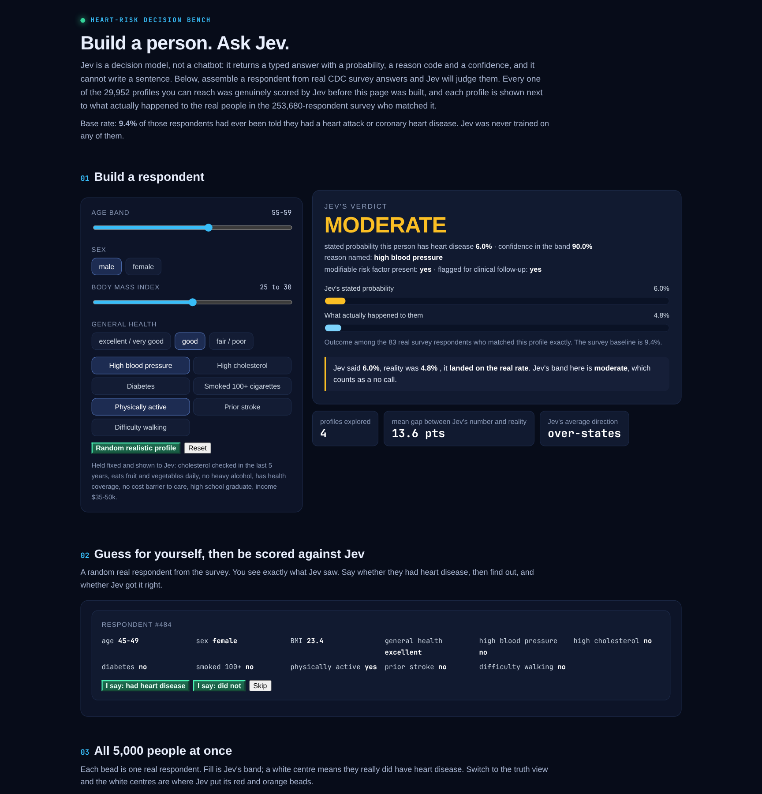
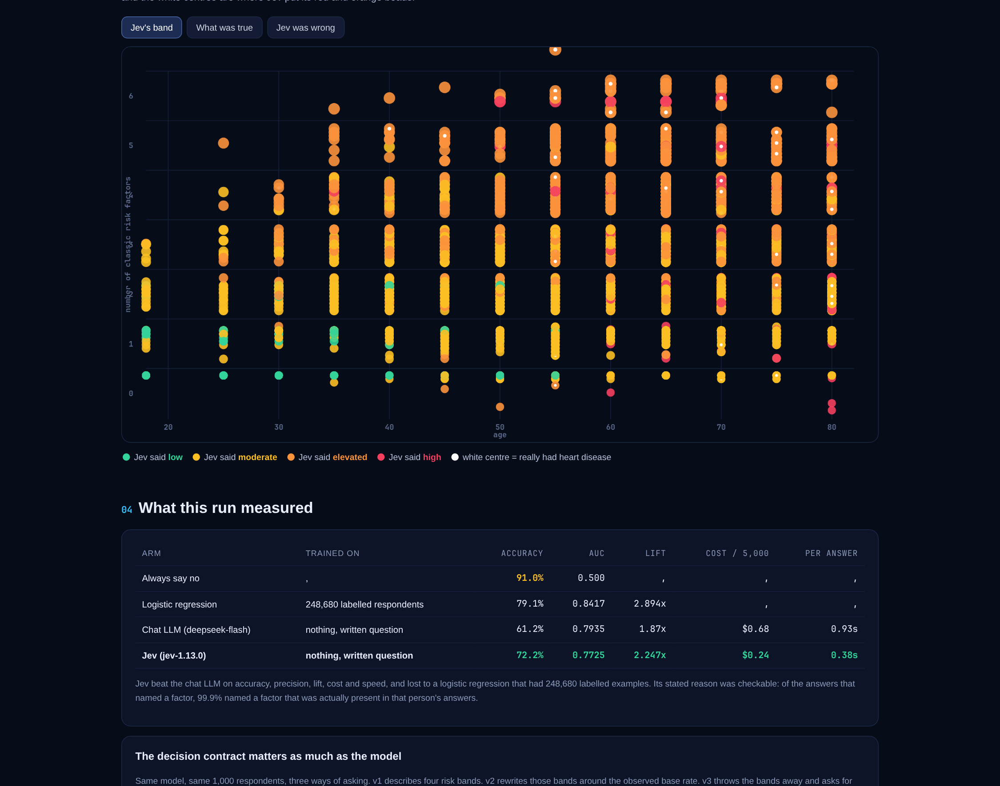

# JEV heart-risk bench

Can a **decision model** read a plain-English health survey and judge a person's heart-disease
risk? This repo scores [Jev](https://typesafe.ai) (TypeSafe's System One, `jev-1.13.0`) on
**5,000 real respondents** from the CDC's 2015 Behavioral Risk Factor Surveillance
System, against a logistic regression, a hand-written rule, a chat LLM and the base rate.

**Interactive demo, build a person and ask Jev:**
https://rubinagentagi-tech.github.io/jev-heart-risk-bench/





Every profile in that demo was genuinely scored by Jev: all 29,952 cells of a full
factorial over the answers the visitor can change, with what actually happened to the real
respondents in each cell shown beside it.

## Headline numbers

All arms scored on the identical 5,000 respondents by the same script
(`src/score.py`). Base rate **9.0%**.

| arm | trained on | accuracy | AUC | precision | recall | lift | cost | per answer |
|---|---|---|---|---|---|---|---|---|
| Always say no |,  | 91.0% | 0.500 |,  | 0% |,  | $0 |,  |
| Hand-written rule (2+ risk factors) |,  | 47.1% | 0.7283 | 13.3% | 88.4% | 1.478x | $0 |,  |
| Logistic regression | 248,680 labelled respondents | 79.1% | 0.8417 | 26.0% | 71.7% | 2.894x | $0 |,  |
| Chat LLM (`deepseek-chat`) | nothing, a written question | 61.2% | 0.7935 | 16.8% | 84.2% | 1.874x | $0.68 | 0.93s |
| **Jev (`jev-1.13.0`)** | **nothing, a written question** | **72.2%** | **0.7725** | **20.2%** | **70.8%** | **2.247x** | **$0.24** | **0.38s** |

Accuracy is a trap here. At a 9.0% base rate, saying "no" to everyone is
91.0% accurate and worthless. Read recall, precision, lift and AUC.

### What it got right

- **Typed output with a checkable reason.** Of the answers naming a factor,
  **99.9%** named a factor that was actually present in that
  person's survey answers. You can audit the reason mechanically instead of reading prose.
- **Cost and speed.** **2.8x cheaper** and
  **2.5x faster** than the chat LLM on the same rows, with
  nothing to parse.

### What it got wrong

- **It lost to a logistic regression** (0.8417 vs 0.7725 AUC) that had
  248,680 labelled examples. Jev had none. That is the honest trade.
- **It over-assigns risk.** It flags
  32% of respondents as elevated
  or high against a 9.0% base rate, and its stated probability is
  **3.05x too high on average**.
- **It fails the auto-accept gate.** At confidence ≥ 0.85 it keeps
  31% of rows with a 9.6%
  error rate, far above the 2% this bench demands before anything is taken without review.
- **Confidence is not accuracy.** Jev's accuracy climbs with its confidence
  (66% → 92%),
  but the actual positive rate inside those bands stays flat near the base rate. Its confidence
  orders the queue; it does not certify the answer.

## Read the head-to-head carefully (an earlier version of this repo got it wrong)

The first version of this README claimed Jev "beat the chat LLM". That was measured at each
model's *own* threshold, which is not a skill comparison: a model that flags more people gets
more recall and less precision no matter how good it is. Jev flags
32% of people, the chat LLM
45%. Compared at *matched*
coverage (`src/analyse_arms.py`, full output in `results/arm-comparison.md`):

| share of people flagged | Jev precision | chat LLM precision | winner |
|---|---|---|---|
| 5% | 35.2% | 37.2% | chat LLM |
| 10% | 28.0% | 27.8% | Jev |
| 15% | 26.1% | 25.3% | Jev |
| 20% | 23.3% | 23.6% | chat LLM |
| 30% | 20.6% | 20.8% | chat LLM |
| 40% | 17.8% | 18.1% | chat LLM |
| 50% | 15.2% | 15.9% | chat LLM |

**The two models are functionally tied.** Every margin is between 0.2 and 2 points on 5,000 rows
holding 449 positives. Inside narrow age bands they are indistinguishable: AUC 0.764 vs 0.766,
0.803 vs 0.805, 0.715 vs 0.706, 0.704 vs 0.701. The AUC difference that looks like a DeepSeek win
(0.7935 vs 0.7725) is the same noise seen through a different lens.

Three findings that matter more than the ranking tie:

1. **Almost all of the signal is age.** Age band used as a bare score gets **AUC 0.7215** on its
   own. Both models add roughly 0.05 of AUC on top of it and then stop. The learnable structure in
   21 survey answers is thin, which is the real reason neither zero-shot arm is impressive.
2. **The chat LLM's probabilities are better calibrated than Jev's.** Stated versus actual:
   DeepSeek says 30-50% and 31.5% of those people are positive; it over-states by 1.36x overall.
   Jev says 90-100% and 28.8% are positive, over-stating by **3.05x**. The usual claim that a
   decision model hands you a calibrated number and an LLM does not is **false on this task**.
3. **The chat LLM's extra recall is noise.** The 670 people *only* the LLM flags are **9.0%**
   positive, exactly the base rate. Its 84.2% recall against Jev's 70.8% is a lower threshold, not
   better detection: catching those 60 extra real cases cost 610 false positives.

So the honest summary is that on this task the two arms are interchangeable on skill, the LLM is
better calibrated, and Jev's advantages are operational: 2.8x cheaper,
2.5x faster, fully typed, with an auditable reason code and
no prompt to drift. The trained logistic regression beats both.

## The decision contract matters as much as the model

Same model, same 1,000 respondents, three ways of asking:

| contract | asks for | accuracy | AUC | what happened |
|---|---|---|---|---|
| v1 | one of four described bands | 74.0% | 0.7864 | flags 30% of people against a 9% rate |
| v2 | bands rewritten around the measured base rate | 65.0% | 0.7925 | worse,  it flags 40%. It follows the words, not the percentages |
| v3 | the probability itself, as a typed judgement | 42.0% | 0.8059 | ranks best, but every answer lands between 8% and 19% |

v3 ranks best and is the most useful shape,  but only if you stop reading the number as a
probability. Set the cut-off in code: at 0.15 it flags 8.4% of respondents at 40.5% precision,
a 4.4x lift over the base rate. The model judges; the cut-off is yours.

## Two bugs worth reading about

1. **The codebook inverted two of the strongest risk factors.** `_RFHYPE5` and `_RFCHOL` in
   BRFSS are coded **1 = No, 2 = Yes**,  the opposite of the raw question variables. The first
   full run scored **AUC 0.4628**, below a coin flip, and Jev looked worthless. The bug was in
   the data pipeline, not the model. After the fix the same contract scored **0.7725**.
   `src/derive_cohort.py` now runs eight direction checks on the derived table and refuses to
   write the cohort if any factor has the wrong sign.
2. **Rewriting criteria to fix over-assignment did not work.** v2 anchored each band to the
   observed rate and made the over-assignment worse. The model treats the criterion text as a
   rule to apply, not as a calibration target to hit.

## Data

- **Survey:** Centers for Disease Control and Prevention, *Behavioral Risk Factor Surveillance
  System 2015*,  https://www.cdc.gov/brfss/annual_data/annual_2015.html
  A US federal government work, **public domain** under 17 U.S.C. § 105.
  Downloaded raw (`LLCP2015XPT.zip`), parsed, and derived to **253,680 complete
  responses**,  the same complete-case count the widely used Kaggle mirror of this table carries,
  which is a useful cross-check on the derivation.
- **Value mappings:** the official [BRFSS 2015 Codebook Report]
  (https://www.cdc.gov/brfss/annual_data/2015/pdf/codebook15_llcp.pdf), quoted in comments next
  to every mapping in `src/derive_cohort.py`.
- **Answer key:** the recorded `_MICHD` answer ("ever told you had a heart attack or coronary
  heart disease"). It is never sent to any model.
- **Model input:** 5,000
  plain-English survey answers per respondent,  age band, sex, BMI, general health, and the
  yes/no risk factors. No diagnosis, no arithmetic.

## Reproduce

```bash
bash download.sh                 # ~95 MB from cdc.gov, unzips to a 1.1 GB SAS transport file
pip install -r requirements.txt
python src/derive_cohort.py      # -> cohort.parquet (253,680 rows, 8 integrity checks)
python src/pack_builder.py --n 5000 --seed 20260920
python src/run_jev.py    --pack cases.jsonl --out results/jev --workers 10
python src/run_baselines.py
python src/run_llm_arm.py --pack cases.jsonl --out results/llm --workers 24
python src/make_grid.py && python src/run_jev_grid.py --pack grid-cases.jsonl --out results/grid
python src/make_app.py           # -> cardio-app.html
```

Cost of this whole bench: **$2.39** in API
calls (34,877,184 tokens for the app lattice alone, 0.24 for Jev and
$0.68 for the chat LLM on the 5,000-respondent benchmark).

## Credits

Created by **Rubin Varghese**. Built with **Jev** (TypeSafe System One, `jev-1.13.0`), with
`deepseek-chat` as the comparison arm and scikit-learn for the logistic regression.
Survey data: CDC BRFSS 2015, public domain. Value mappings: CDC BRFSS 2015 Codebook Report.

This is a demonstration on public survey data. It is not a medical device, not clinical advice,
and must not be used to make decisions about anyone's care.
